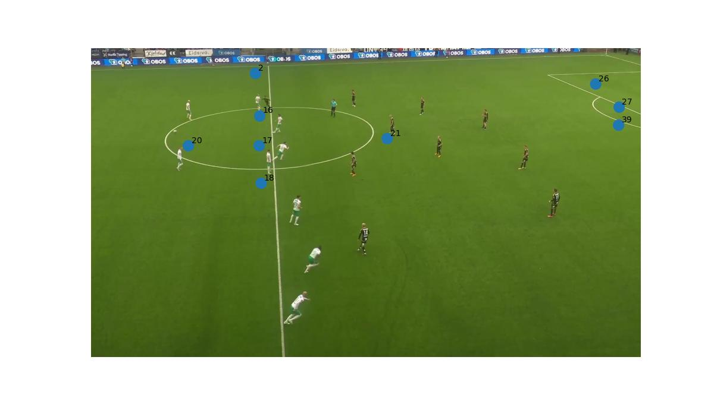

# ⚽ Keypoint Detection

This project detects keypoints on a football pitch from image fragments. The model predicts the locations of key landmarks on the pitch, which are then saved for further analysis or visualization.

🗺️ Keypoint Map

The keypoints are labeled according to the layout shown below:
<p align="center">
  
</p>

📷 Example Output

Here is an example of a test image with its predicted keypoints visualized:
<p align="center">
  
</p>

## 🚀 How to Run the Model

Step 1: Run Inference
Navigate to the inference directory:
```bash
cd pitch_geo/inference
```
Update the input_dir path in inference.py to point to your image folder.

Then run at ./FootballKeypointDetection:
```bash
PYTHONPATH=. python pitch_geo/inference/inference.py
```
This will generate a CSV file (outputs/output_keypoints.csv) containing all predicted keypoints for the input images.

Step 2: Visualize Keypoints
Run the following script to draw keypoints on the images:
```bash
PYTHONPATH=. python pitch_geo/show_keypoints.py outputs/output_keypoints.csv /home/weijunl/Football-Object-Detection/datasets/dataset/test/images ./images_output_test
```
The first argument is the path to the CSV file with keypoints.

The second argument is the path to the original test images.

The third argument is the output directory where the annotated images will be saved.
